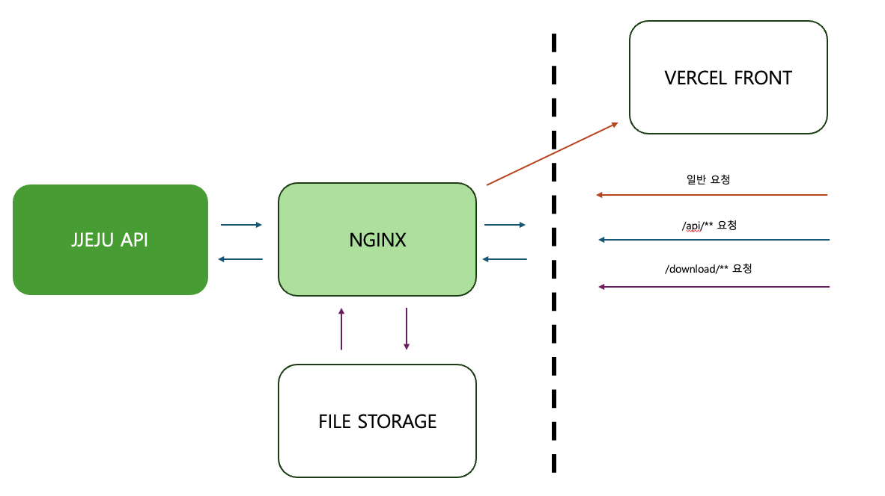

**제주프로젝트 백엔드 서버 입니다.**
<br/><br/>제주도 여행 플랜을 만들기 위한 프로젝트 입니다.

## 프로젝트 소개 🎈:

• 🖥️ 제주 프로젝트 서버 입니다. <br/>
• ☕ 자바 버전은 <b>17</b>입니다.<br/>
• 🍃 SpringBoot 버전은 <b>3.1.7</b>입니다.<br/>
• 👤 프로필은 <b>local</b> 과 <b>dev</b>가 있습니다. 개인 환경에서는 <b>local</b>로 개발해주세요.
</span>

## 🕸️ **기능 설명**
### 로그인/로그아웃
- SpringSecurity6 를 이용하여 JWT Token 인가 방식으로 로그인을 구현했습니다.
- 로그아웃은 로그인시 발급받았던 <b>RefreshToken</b>을 <b>BlackList</b>로 처리하여 다시 재 로그인을 하도록 구현했습니다.

### Docs
- [문서](http://jjeju.site/api/docs/index.html)를 작성하여 프론트엔드와 쉽게 협업할 수 있도록 만들었습니다
- SpringRestDocs를 이용하여 테스트를 통과한 API만 문서화가 되도록 했습니다.

### 아키텍처
- /api 의 루트컨텍스트를 가진 요청은 API서버로 요청되게 했습니다.
- 일반요청은 VERCEL로 라우팅처리 했으며, /download 요청은 저장했던 파일데이터에 접근 하도록 처리했습니다.
- 안드로이드 Termux를 이용해 구축했습니다.
- 아래와 같이 구성했습니다.



## 🕸️ **파일 구조**
```bash
├── .github
│   └── workflows
│       └── gradle.yml
├── build.gradle
├── gradle
│   └── wrapper
│       ├── gradle-wrapper.jar
│       └── gradle-wrapper.properties
├── gradlew
├── gradlew.bat
├── nginx
│   └── nginx
│       ├── conf.d
│       │   └── http.conf
│       ├── fastcgi.conf
│       ├── fastcgi_params
│       ├── koi-utf
│       ├── koi-win
│       ├── mime.types
│       ├── nginx.conf
│       ├── scgi_params
│       ├── uwsgi_params
│       └── win-utf
├── settings.gradle
├── src
│   ├── docs
│   │   └── asciidoc
│   │       └── index.adoc
│   ├── main
│   │   ├── java
│   │   │   └── com
│   │   │       └── travel
│   │   │           └── jeju
│   │   │               ├── JejuApplication.java
│   │   │               ├── config
│   │   │               │   ├── ApiSecurityConfig.java
│   │   │               │   ├── LocalDateTimeTypeHandler.java
│   │   │               │   ├── LocalDateTypeHandler.java
│   │   │               │   └── ServerConfig.java
│   │   │               ├── constant
│   │   │               │   ├── AuthConstants.java
│   │   │               │   ├── FailType.java
│   │   │               │   ├── FileConstant.java
│   │   │               │   ├── FileDescConstant.java
│   │   │               │   └── UserType.java
│   │   │               ├── controller
│   │   │               │   ├── AdminController.java
│   │   │               │   ├── BasketController.java
│   │   │               │   ├── CompanyController.java
│   │   │               │   ├── JejuPlanController.java
│   │   │               │   ├── MainController.java
│   │   │               │   ├── MemberController.java
│   │   │               │   ├── MypageController.java
│   │   │               │   ├── SvcenterController.java
│   │   │               │   └── TripController.java
│   │   │               ├── dto
│   │   │               │   ├── AactivityDto.java
│   │   │               │   ├── AimgDto.java
│   │   │               │   ├── AoptionDto.java
│   │   │               │   ├── BasketDto.java
│   │   │               │   ├── BimgDto.java
│   │   │               │   ├── BlogDto.java
│   │   │               │   ├── BreplyDto.java
│   │   │               │   ├── CalendarDto.java
│   │   │               │   ├── CimgDto.java
│   │   │               │   ├── CompanyDto.java
│   │   │               │   ├── ComplaintDto.java
│   │   │               │   ├── EventDto.java
│   │   │               │   ├── EventDto2.java
│   │   │               │   ├── FavoritesDto.java
│   │   │               │   ├── IamBasketDto.java
│   │   │               │   ├── JejusimgDto.java
│   │   │               │   ├── JejuspotDto.java
│   │   │               │   ├── JejuspotreviewDto.java
│   │   │               │   ├── LastBlogDto.java
│   │   │               │   ├── ListDto.java
│   │   │               │   ├── LoptionDto.java
│   │   │               │   ├── MemberDto.java
│   │   │               │   ├── MessagesDto.java
│   │   │               │   ├── NoticeDto.java
│   │   │               │   ├── NowTripDto.java
│   │   │               │   ├── PastTripBlogDto.java
│   │   │               │   ├── ProductDto.java
│   │   │               │   ├── RevDto.java
│   │   │               │   ├── ReviewDto.java
│   │   │               │   ├── RoomDto.java
│   │   │               │   ├── RoomImgDto.java
│   │   │               │   ├── ScheduleDto.java
│   │   │               │   ├── SimgDto.java
│   │   │               │   ├── SmsDto.java
│   │   │               │   ├── SmsRequest.java
│   │   │               │   ├── SmsResponse.java
│   │   │               │   ├── SpotDto.java
│   │   │               │   ├── TokenBlackDto.java
│   │   │               │   ├── TravelPlanDto.java
│   │   │               │   ├── TravelrouteDto.java
│   │   │               │   └── jejuplanDto.java
│   │   │               ├── exception
│   │   │               │   ├── AppException.java
│   │   │               │   ├── ExceptionCode.java
│   │   │               │   ├── Level.java
│   │   │               │   ├── ServerExceptionHandler.java
│   │   │               │   └── Source.java
│   │   │               ├── jwt
│   │   │               │   ├── CustomAccessDeniedHandler.java
│   │   │               │   ├── CustomAuthenticationEntryPointHandler.java
│   │   │               │   ├── CustomAuthenticationFailureHandler.java
│   │   │               │   ├── CustomAuthenticationProvider.java
│   │   │               │   ├── CustomAuthenticationSuccessHandler.java
│   │   │               │   ├── CustomLogoutSuccessHandler.java
│   │   │               │   ├── JwtAuthenticationFilter.java
│   │   │               │   ├── JwtAuthorizationFilter.java
│   │   │               │   ├── JwtTokenProvider.java
│   │   │               │   └── UserDetailsSecurityService.java
│   │   │               ├── mapper
│   │   │               │   ├── AdminMapper.java
│   │   │               │   ├── BasketMapper.java
│   │   │               │   ├── CompanyMapper.java
│   │   │               │   ├── FileMapper.java
│   │   │               │   ├── JejuplanMapper.java
│   │   │               │   ├── MainMapper.java
│   │   │               │   ├── MapMapper.java
│   │   │               │   ├── MemberMapper.java
│   │   │               │   ├── MypageMapper.java
│   │   │               │   ├── SvcenterMapper.java
│   │   │               │   └── TravelrouteMapper.java
│   │   │               ├── model
│   │   │               │   ├── admin
│   │   │               │   ├── basket
│   │   │               │   │   ├── InsertBasketRQ.java
│   │   │               │   │   └── InsertBasketReserveRQ.java
│   │   │               │   ├── common
│   │   │               │   │   ├── BaseErrorModel.java
│   │   │               │   │   ├── BaseModel.java
│   │   │               │   │   ├── FileModel.java
│   │   │               │   │   └── PageModel.java
│   │   │               │   ├── company
│   │   │               │   ├── main
│   │   │               │   │   ├── business
│   │   │               │   │   │   ├── BusinessFileModel.java
│   │   │               │   │   │   ├── BusinessItemModel.java
│   │   │               │   │   │   ├── BusinessPlaceModel.java
│   │   │               │   │   │   ├── item
│   │   │               │   │   │   │   ├── SearchBusinessItemDetailRS.java
│   │   │               │   │   │   │   └── SearchBusinessItemRS.java
│   │   │               │   │   │   └── place
│   │   │               │   │   │       ├── SelectBusinessPlaceRQ.java
│   │   │               │   │   │       └── SelectBusinessPlaceRS.java
│   │   │               │   │   ├── home
│   │   │               │   │   │   ├── HomeBusinessRS.java
│   │   │               │   │   │   ├── HomeComplaintRS.java
│   │   │               │   │   │   ├── HomeEventSpotRS.java
│   │   │               │   │   │   └── HomeNoticeRS.java
│   │   │               │   │   ├── insert_favorite
│   │   │               │   │   │   └── InsertFavoriteRQ.java
│   │   │               │   │   ├── insert_review
│   │   │               │   │   │   └── InsertReviewRQ.java
│   │   │               │   │   ├── option_check
│   │   │               │   │   │   └── OptionCheckRQ.java
│   │   │               │   │   ├── public_blog
│   │   │               │   │   │   └── SelectPublicBlogRS.java
│   │   │               │   │   └── update_pay
│   │   │               │   │       └── UpdatePayRQ.java
│   │   │               │   ├── member
│   │   │               │   │   ├── LoginRQ.java
│   │   │               │   │   ├── LoginRS.java
│   │   │               │   │   ├── MemberModel.java
│   │   │               │   │   ├── TokenModel.java
│   │   │               │   │   ├── cert_sms
│   │   │               │   │   │   └── CertSmsRQ.java
│   │   │               │   │   ├── insert_member
│   │   │               │   │   │   └── InsertMemeberRQ.java
│   │   │               │   │   ├── profile
│   │   │               │   │   │   ├── ProfileModel.java
│   │   │               │   │   │   └── SelectProfileRS.java
│   │   │               │   │   └── refresh_token
│   │   │               │   │       ├── RefreshTokenRQ.java
│   │   │               │   │       └── RefreshTokenRS.java
│   │   │               │   ├── mypage
│   │   │               │   │   ├── blog
│   │   │               │   │   │   ├── create
│   │   │               │   │   │   │   └── CreateBlogRQ.java
│   │   │               │   │   │   ├── select
│   │   │               │   │   │   │   ├── MypageBlogDetailRS.java
│   │   │               │   │   │   │   ├── MypageBlogParam.java
│   │   │               │   │   │   │   ├── MypageBlogRQ.java
│   │   │               │   │   │   │   └── MypageBlogRS.java
│   │   │               │   │   │   └── update
│   │   │               │   │   │       ├── MypageBlogAddPictureRQ.java
│   │   │               │   │   │       └── MypageBlogUpdateRQ.java
│   │   │               │   │   ├── deal
│   │   │               │   │   │   ├── MypageDealParam.java
│   │   │               │   │   │   ├── MypageDealRQ.java
│   │   │               │   │   │   └── MypageDealRS.java
│   │   │               │   │   ├── favorite
│   │   │               │   │   │   ├── MypageFavoriteParam.java
│   │   │               │   │   │   ├── MypageFavoriteRS.java
│   │   │               │   │   │   └── MypageFavoriteVO.java
│   │   │               │   │   ├── home
│   │   │               │   │   │   └── MypageHomeRS.java
│   │   │               │   │   ├── member
│   │   │               │   │   │   ├── MypageMemberPasswordCheckRQ.java
│   │   │               │   │   │   ├── MypageMemberPasswordUpdateRQ.java
│   │   │               │   │   │   └── MypageMemberUpdateRQ.java
│   │   │               │   │   ├── review
│   │   │               │   │   │   ├── MypageReviewParam.java
│   │   │               │   │   │   └── MypageReviewRS.java
│   │   │               │   │   └── travel
│   │   │               │   │       ├── MypageTravelDetailRS.java
│   │   │               │   │       ├── MypageTravelParam.java
│   │   │               │   │       ├── MypageTravelRS.java
│   │   │               │   │       └── MypageTravelUpdateComplateRQ.java
│   │   │               │   ├── svcenter
│   │   │               │   │   ├── notice
│   │   │               │   │   │   ├── NoticeRQ.java
│   │   │               │   │   │   └── NoticeRS.java
│   │   │               │   │   └── qa
│   │   │               │   │       ├── QaInsertRQ.java
│   │   │               │   │       ├── QaMyListParam.java
│   │   │               │   │       ├── QaMyListRQ.java
│   │   │               │   │       ├── QaMyListRS.java
│   │   │               │   │       ├── QaRQ.java
│   │   │               │   │       └── QaRS.java
│   │   │               │   └── travel
│   │   │               │       ├── TravelInsertRQ.java
│   │   │               │       ├── TravelInsertRS.java
│   │   │               │       └── plan
│   │   │               │           ├── DaysModel.java
│   │   │               │           ├── InsertPlanModel.java
│   │   │               │           ├── SelectPlanModel.java
│   │   │               │           ├── TravelPlanArraySortObject.java
│   │   │               │           ├── TravelPlanInsertRQ.java
│   │   │               │           ├── TravelPlanSelectRS.java
│   │   │               │           ├── TravelPlanUpdateRQ.java
│   │   │               │           └── UpdatePlanModel.java
│   │   │               ├── service
│   │   │               │   ├── AdminService.java
│   │   │               │   ├── BasketService.java
│   │   │               │   ├── JejuService.java
│   │   │               │   ├── MainService.java
│   │   │               │   ├── MemberService.java
│   │   │               │   ├── MypageService.java
│   │   │               │   ├── SvcenterServcie.java
│   │   │               │   └── TripService.java
│   │   │               └── util
│   │   │                   ├── DateUtil.java
│   │   │                   ├── FileUtil.java
│   │   │                   ├── PagingUtil.java
│   │   │                   ├── Principal.java
│   │   │                   └── RandomUtil.java
│   │   └── resources
│   │       ├── application-dev.yml
│   │       ├── application-local.yml
│   │       ├── application.yml
│   │       ├── jwt.yml
│   │       ├── log4jdbc.log4j2.properties
│   │       ├── logback-spring.xml
│   │       ├── mybatis-config.xml
│   │       ├── sql
│   │       │   ├── AdminMapper.xml
│   │       │   ├── BasketMapper.xml
│   │       │   ├── CompanyMapper.xml
│   │       │   ├── FileMapper.xml
│   │       │   ├── MainMapper.xml
│   │       │   ├── MemberMapper.xml
│   │       │   ├── MypageMapper.xml
│   │       │   ├── SvcenterMapper.xml
│   │       │   ├── TravelrouteMapper.xml
│   │       │   └── jejuplanMapper.xml
│   │       ├── static
│   │       │   ├── docs
│   │       │   │   └── index.html
│   │       │   └── upload
│   │       └── templates
│   └── test
│       ├── java
│       │   └── com
│       │       └── travel
│       │           └── jeju
│       │               ├── BaseTest.java
│       │               ├── JejuApplicationTests.java
│       │               ├── admin
│       │               │   └── AdminControllerTest.java
│       │               ├── basket
│       │               │   └── BasketControllerTest.java
│       │               ├── company
│       │               ├── jeju_plan
│       │               │   └── JejuPlanControllerTest.java
│       │               ├── main
│       │               │   └── MainControllerTest.java
│       │               ├── member
│       │               │   └── MemberControllerTest.java
│       │               ├── mypage
│       │               │   └── MypageControllerTest.java
│       │               ├── svcenter
│       │               │   └── SvcenterControllerTest.java
│       │               ├── trip
│       │               │   └── TripControllerTest.java
│       │               └── weather_api
│       └── resources
│           └── org
│               └── springframework
│                   └── restdocs
│                       └── templates
│                           ├── path-parameters.snippet
│                           ├── query-parameters.snippet
│                           ├── request-fields.snippet
│                           ├── request-headers.snippet
│                           └── response-fields.snippet
└── table.sql
```

<br />

## ⚙️ **BACKEND DEV**


## 📅 **DATABASES**


## 🎯 **PROGRAMMING LANGUAGES**


## 🛠️ **DEVOPS TOOLS**


## 📄 **CODE EDITOR & IDES**


